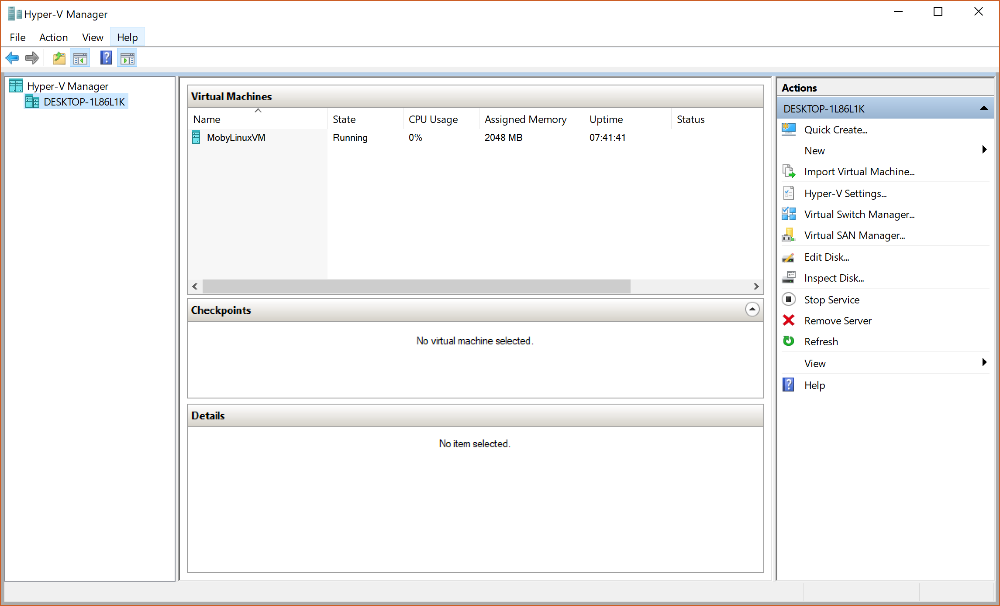
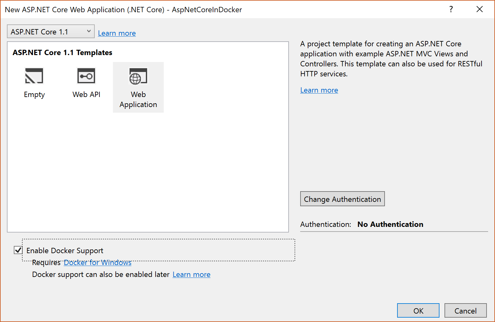
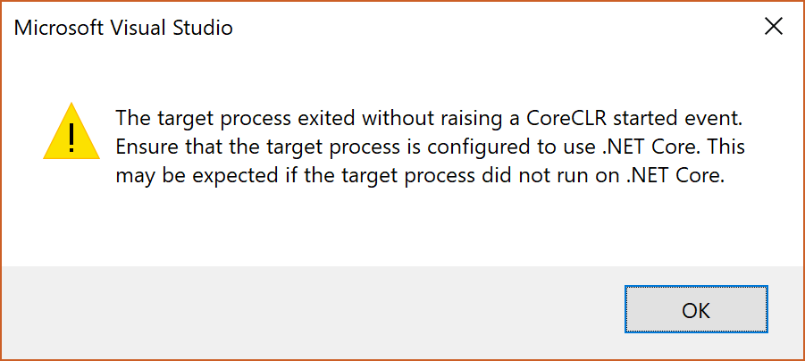

In this post I'm going to take you through getting a .NET Core running on Linux docker container. I'm not an expert and will refer back to the Bad Old Days (BOD) a lot.

## Pre-requisites
You might find alternatives to these tools but they are the ones that my team and I use. Before you install, make sure you [understand the caveats from docker](https://docs.docker.com/docker-for-windows/install/#what-to-know-before-you-install).

- Windows 10 Pro x64, Microsoft Hyper-V
- Visual Studio 2017

## Install Docker for Windows
[Download Docker for Windows](https://docs.docker.com/docker-for-windows/install/#download-docker-for-windows) I recommend the stable channel. I used the defaults for everything, I suggest you do too!

Once docker for Windows is installed, find the docker whale icon in the status bar right click and choose `Settings...`. On the left of the settings window, choose `Shared Drives` and tick the box for `C:`. This will give the docker machine access to the files on the `C:` drive, which is doesn't have by default.

## Why did I need Hyper-V?
That was a question I found myself asking at first. Where Docker is the application that is running in your system tray, the virtual machine that hosts the actual docker container is in Hyper-V. Let's have a look at that.

In Windows hit the windows key and type `Hyper-V` to get the Hyper-V Manager. You'll see this:

There's only one Virtual Machine (VM) running called **MobyLinuxVM**. It's called Moby because docker is now a trademark used by the support company and [Moby](https://blog.docker.com/2017/04/introducing-the-moby-project/) is the name given to the open source bit. Moby Linux is an alpine distro of Linux with addition to allow communication between the virtual machine and Hyper-V.

The default IP of the docker host virtual machine is 10.0.75.1. That will come in useful later.

## New ASP.NET Core Project
Open up Visual Studio 2017 and create an ASP.NET Core Web Application. Select `Enable Docker Support`.

Once complete, you can run it straight away by pressing F5. You'll notice that the output window from the build has lots more output in it. That's the docker compose system.

If you need to add docker support to an existing solution, you can do that by adding the docker compose project

## Target process exited without raising a CoreCLR started event
At first I saw this:

In Visual Studio check the Debug output window for the reason why:

    realpath(): Invalid argument
    The specified framework 'Microsoft.NETCore.App', version '1.1.2' was not found.
      - Check application dependencies and target a framework version installed at: /usr/share/dotnet/shared/Microsoft.NETCore.App
      - The following versions are installed:
      1.1.1
      - Alternatively, install the framework version '1.1.2'.
    The program '' has exited with code 131 (0x83).

Installing the latest version of .NET Core will solve this problem but why is it happening? Let's look at...

## The Dockerfile
In your ASP.NET Core project you'll find a Dockerfile (no file extension). The Dockerfile is a build file for creating a docker image. Each line is a command. It will look a little like this:

    FROM microsoft/aspnetcore:1.1
    ARG source
    WORKDIR /app
    EXPOSE 80
    COPY ${source:-obj/Docker/publish} .
    ENTRYPOINT ["dotnet", "AspNetCoreInDocker.dll"]

The first line `microsoft/aspnetcore:1.1` is the base image. The name breaks down as `[maintainer]/[image]:[tag]`. So this is an image that's maintained by Microsoft, has ASP.NET Core on it and has the version tag of 1.1. You can find all the tags on the [Docker Hub page for this image](https://hub.docker.com/r/microsoft/aspnetcore/). You can use `FROM microsoft/aspnetcore:latest` to get yourself running. ([I've started a Stack Overflow question to understand why](https://stackoverflow.com/questions/44134429/why-does-latest-aspnet-core-docker-image-run-when-the-tag-1-1-fails)).

Run the solution again and a browser window will open with the default ASP.NET Core project being shown. .NET is now running in a Linux docker container on a Linux host.