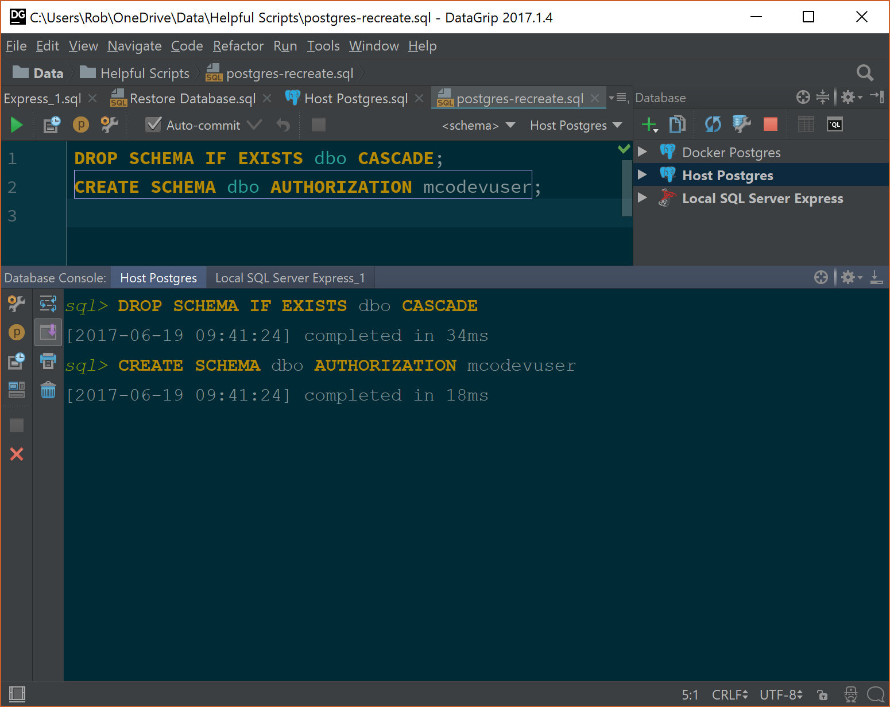

[Local DB](https://blogs.msdn.microsoft.com/sqlexpress/2011/07/12/introducing-localdb-an-improved-sql-express/) is a lightweight replacement to SQL Express that is installed as part of Visual Studio. It's free, 100% compatible with SQL Server, runs on database up to 10GB of data and you can connect using a connection string.

## DataGrip
[DataGrip](https://www.jetbrains.com/datagrip/) is a relational database management tool by JetBrains. I've found it easier to use for SQL Server, Postgres and MySQL than dedicated tools. Being able to switch tabs, set themes and compare output in a single UI has been really useful on projects where I need to use more than one database engine. It's not free but there is a 30 day trial, which I urge you to try. Here's what my UI looks like, setup how I like it:

## An error connecting to Local DB
When [connecting to LocalDB](https://blog.jetbrains.com/datagrip/2016/10/07/connecting-datagrip-to-sql-server-express-localdb/) I often receive the error:

    [2017-06-19 11:52:50] java.io.FileNotFoundException: \\.\pipe\MSSQL$\<pipe name>\sql\query (The system cannot find the file specified)

It also fails in the Test Connection window.

## LocalDB is not running!
LocalDB is significantly different to SQL Server Express in that it is very lightweight and *does not run as a service*. It can be started and stopped when needed. What the error above is telling us is that LocalDB has not been started. If you use Visual Studio SQL Server Object Explorer, then the database will appear to be there because Visual Studio know that it needs to run LocalDB. DataGrip doesn't have a concept of starting LocalDB. Viewing the LocalDB in Visual Studio will solve the DataGrip error because LocalDB will now be running.

## Command Line with LocalDB
LocalDB [comes with a command line](https://docs.microsoft.com/en-us/sql/relational-databases/express-localdb-instance-apis/command-line-management-tool-sqllocaldb-exe) called `SqlLocalDB.exe` that can be used from your Windows command prompt.

Find out what your instances are:

    C:\>sqllocaldb i
    MSSQLLocalDB
    ProjectsV12
    ProjectsV13

Get detailed information for an instance:

    C:\>sqllocaldb i projectsv13
    Name:               ProjectsV13
    Version:            13.0.1601.5
    Shared name:
    Owner:              MyPCName\Rob
    Auto-create:        No
    State:              Running
    Last start time:    19/06/2017 11:59:28
    Instance pipe name: np:\\.\pipe\LOCALDB#C2BC2C23\tsql\query

Note that the state there is "Running".

Stop a Local DB instance:

    C:\>sqllocaldb stop projectsv13
    LocalDB instance "ProjectsV13" stopped.

Start a local DB instance:

    C:\>sqllocaldb start projectsv13
    LocalDB instance "ProjectsV13" started. 

That is the command line way to rid yourself of the DataGrip problem.