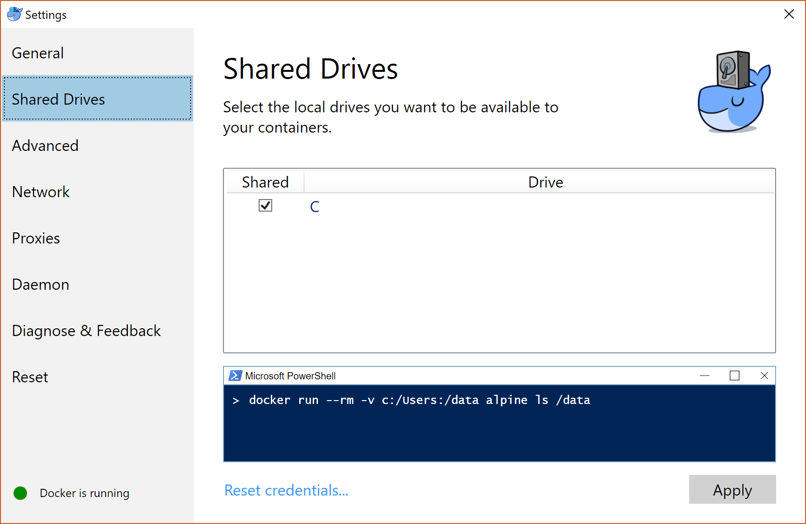
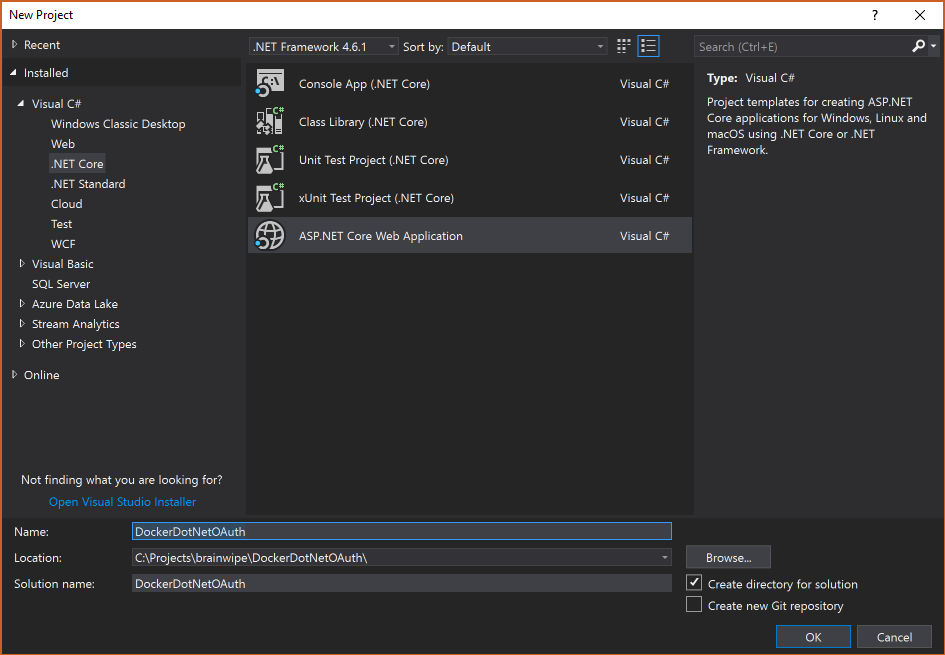
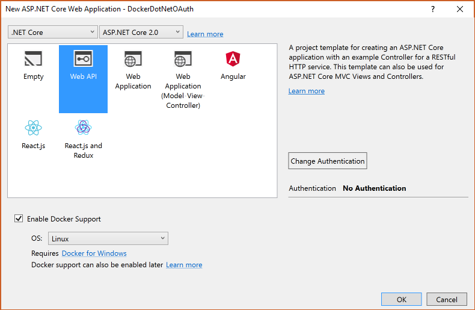
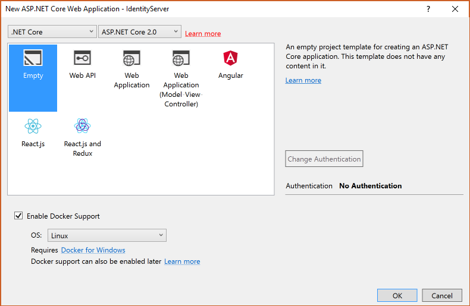
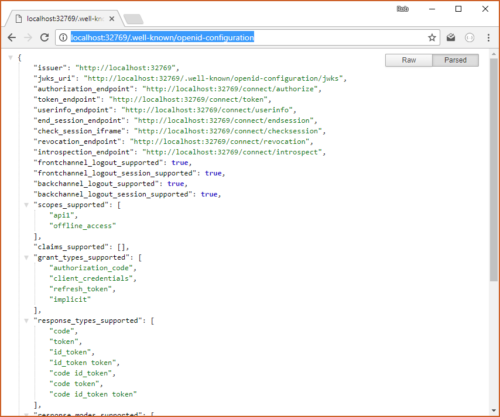

I previously explained how to get a [ASP.NET Core 1 site running on docker](/2017-05-23-docker-linux-dotnet) in this post we're going to do a similar process but use .NET Core 2 an add OAuth authentication. The first few steps are the same, it starts to change when we create our projects. [OAuth](https://oauth.net/) is a protocol for allow secure authorization. We will be using [Identity Server 4](https://identityserver.io/) running in its own container to provide us with a token when we give it a username and password.

In this part we'll set up the API and Identity Server. In [Part 2](/2017-10-30-oauth-on-docker-part2) we will add a client and authorization to this service.

The finished code (for both parts) is on my [DockerDotNetOAuth](https://github.com/brainwipe/DockerDotNetOAuth) GitHub repository.

## Why run a separate container for Identity Server?

You *can* run Identity Server in your [existing ASP.NET Core MVC project](https://identityserver4.readthedocs.io/en/release/quickstarts/0_overview.html). However, containerisation gives us the ability to split up our application into separate micro services. 

The benefits of splitting out the Identity Server are:

- You can deploy authentication separately to your product domain and vice versa
- It's easier to swap out your authentication framework if you start with it separated
- You can scale out your product domain without duplicating your authentication

The drawback is that **it's more complicated**! Hopefully, once you have it working then you can spend your time on building just your product domain.

## Install Docker for Windows

[Download Docker for Windows](https://docs.docker.com/docker-for-windows/install/#download-docker-for-windows). I recommend the stable channel. I used the defaults for everything, I suggest you do too!

Once docker for Windows is installed, find the docker whale icon in the status bar right click and choose `Settings...`. On the left of the settings window, choose `Shared Drives` and tick the box for `C:`. This will give the docker machine access to the files on the `C:` drive, which is doesn't have by default.



## Create the new Project

Click `File -> New Project` and under Visual C#/.NET Core choose a new ASP.NET Core Web Application. Give it a meaningful name (better than the one I came up with!) as below.



For the project settings, select Web API. If you want to make an MVC website rather than an API, then follow the tutorials on the [Identity Server website](http://docs.identityserver.io/en/release/quickstarts/0_overview.html). At the top, select ASP.NET Core 2.0 in the framework drop down (it's the default). Check the 'Docker Support' checkbox, select Linux as the OS, leave authentication unchecked (we'll do that manually), click OK.



Make sure you have Docker for Windows running and the docker-compose project is selected as the Start Up project and hit F5 to run the project. The Web API project comes with a default service endpoint that delivers a bit of JSON.

# The Initial Docker Compose File
The docker-compose file is a `yml` file that describes what containers are going to be built and run when you press F5. So far we have a single container which will be called `dockerdotnetoauth`, and has a Docker File in the project directory. You'll also notice that docker-compose has a child file `docker-compose.override.yml` that has bindings that visual studio needs.

```yml
version: '3'

services:
dockerdotnetoauth:
    image: dockerdotnetoauth
    build:
        context: ./DockerDotNetOAuth
        dockerfile: Dockerfile
```

## Create Identity Server Project
A Secure Token Server (STS) uses the OAuth authentication mechanism. The STS gives a token to a client that the client passes to the API. The API then calls Identity Server to check that the token is valid. 

Identity Server is an STS implementation in .NET Core that plugs into the ASP.NET Core pipeline, so it needs a website to host it. We're going to run that new website in a ASP.NET Core Linux docker container too.

In the Solution Explorer, Right click the Solution, Add -> New Project. Create a new ASP.NET Core Web Application called IdentityServer. Create it as an Empty ASP.NET Core 2.0 project with Linux Docker support and no authentication.



Once the project has been built, you'll notice that a new entry has been added to the docker-compose file, which now looks like this:

```yml
version: '3'

services:
dockerdotnetoauth:
    image: dockerdotnetoauth
    build:
        context: ./DockerDotNetOAuth
        dockerfile: Dockerfile

identityserver:
    image: identityserver
    build:
        context: ./IdentityServer
        dockerfile: Dockerfile
```

This means that two separate containers will be built and run when you run the solution. If you press F5 right now then you'll still see the original API service because that's the default page. To see what's running in docker open a PowerShell window and write `docker ps`:

```powershell
C:\> docker ps
CONTAINER ID        IMAGE                   COMMAND               CREATED              STATUS              PORTS                   NAMES
04e906a3617b        dockerdotnetoauth:dev   "tail -f /dev/null"   About a minute ago   Up About a minute   0.0.0.0:32771->80/tcp   dockercompose3858451035021284432_dockerdotnetoauth_1
639c48d06f11        identityserver:dev      "tail -f /dev/null"   About a minute ago   Up About a minute   0.0.0.0:32772->80/tcp   dockercompose3858451035021284432_identityserver_1
```

Scroll to the right and you'll see the Ports column that shows the mapping from localhost to the internal container port. You can see that the API container is on port `32771` and the empty identity server is on port `32772`. These ports might be different for you. To see the identity server, open a browser to `http://localhost:32772`. You'll get a simple "Hello World!" for output.

## Identity Server Install
We're going to get Identity Server working first and then move onto authentication and authorization in [Part 2](/2017-10-30-oauth-on-docker-part2).

On your Identity Server project, install the `nuget` package [IdentityServer4.AspNetCore](https://www.nuget.org/packages/IdentityServer4/) by Brock Allen and Dominick Baier. Open the Identity Server `Startup.cs`. Remove the fluff (including Hello World) and add Identity Server to both the services and the application like so:

```cs
public class Startup
{
    public void ConfigureServices(IServiceCollection services)
    {
        services.AddIdentityServer()
            .AddDeveloperSigningCredential();
    }

    public void Configure(IApplicationBuilder app, IHostingEnvironment env)
    {
        if (env.IsDevelopment())
        {
            app.UseDeveloperExceptionPage();
        }

        app.UseIdentityServer();
    }
}
```

## Adding Identity Server Configuration

We need to tell Identity Server what API resources (called **scopes**)  we're going to protect and who the **clients** are that are going to call them. For simplicity, we're going to configure this in memory by hard coding a class called Configuration. In your Identity Server project, create a new class on the root called `Configuration.cs`. We're going to follow the [Identity Server 4 guide](http://docs.identityserver.io/en/release/quickstarts/1_client_credentials.html) to create this class:

```cs
public static class Configuration
{
    public static IEnumerable<ApiResource> GetApiResources()
    {
        return new List<ApiResource>
        {
            new ApiResource("api1", "My API")
        };
    }

    public static IEnumerable<Client> GetClients()
    {
        return new List<Client>
        {
            new Client
            {
                ClientId = "client",

                // no interactive user, use the clientid/secret for authentication
                AllowedGrantTypes = GrantTypes.ClientCredentials,

                // secret for authentication
                ClientSecrets =
                {
                    new Secret("secret".Sha256())
                },

                // scopes that client has access to
                AllowedScopes = { "api1" }
            }
        };
    }
}
```

The configuration says that it will protect an API resource called "My API" with key `api1` and we have a single `Client` that is allowed to access the API if it has a secret, which is simply the hash of the string "secret".

Now return the `Startup.cs` file and add this configuration to Identity Server:

```cs
public class Startup
{
    public void ConfigureServices(IServiceCollection services)
    {
        services.AddIdentityServer()
            .AddDeveloperSigningCredential()    
            .AddInMemoryApiResources(Configuration.GetApiResources())
            .AddInMemoryClients(Configuration.GetClients());
    }

    // snipped the rest for brevity
```

## Test Identity Server using its Discover Document

The [OAuth 2 specification](https://tools.ietf.org/html/draft-ietf-oauth-discovery-06) defines a discovery document, also known as the "well known" document which is a JSON file that explains how the secure token server can be used. When an API wants validate a token, it will look for the discovery document first.

Now that you've specified scopes and clients, you can now see the well known on you docker container Identity Server: `http://localhost:32772/.well-known/openid-configuration`. Here's what it looks like in a browser:



## End of Part 1
We have created an ASP.NET Core 2 Web API running in a Linux docker container, then added Identity Server into its own container and configured it. In [Part 2](/2017-10-30-oauth-on-docker-part2) we will create a client container and apply authorization to the Web API so that you'll need the secret to access it.